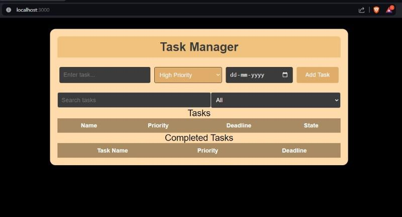

Managing your tasks is one of the most important things in a hectic routine. In this article, we will see step-by-step procedure of creating a task manager app from scratch.

Output Preview: Let us have a look at how the final output will look like.

Prerequisites :
Introduction to Next.js
React Hooks
NPM or NPX
Approach to create Daily Activity Planner:
State Management: For efficient task and input field handling, use useState.
Input Handling: Put in place handlers for the name, priority, and deadline of each task.
Task Functions: Task operations are managed by functions such as addTask, EditTask, DeleteTask, and markDone.
Improve user experience (UX) by using filtered tasks to effortlessly filter tasks according to user-specified requirements.

